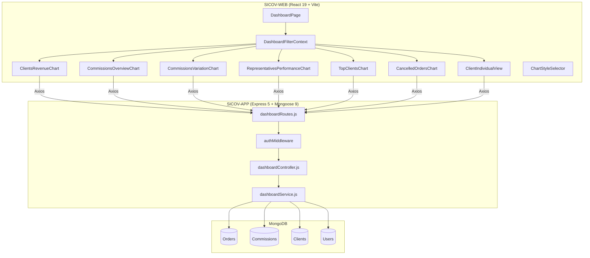
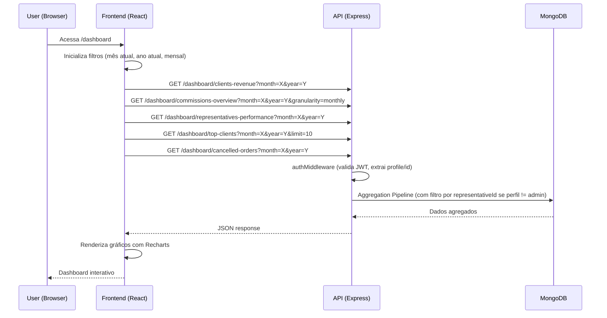

# Design Document: Dashboard

## Overview

Este documento descreve o design técnico da funcionalidade de Dashboard interativo do SICOV. O Dashboard fornece visualizações gráficas sobre faturamento, comissões, desempenho de representantes e pedidos cancelados, com filtros temporais globais e controle de acesso baseado em perfil (admin vs representante).

### Decisões de Design

1. **Biblioteca de gráficos**: Recharts — leve, declarativa, compatível com React 19, suporta todos os tipos de gráfico necessários (bar, line, pie, area, treemap).
2. **Arquitetura de dados**: Endpoints dedicados com agregação via MongoDB Aggregation Pipeline no backend, evitando processamento pesado no frontend.
3. **Controle de acesso**: Filtragem no backend por `representativeId` extraído do JWT — o frontend apenas oculta seções, mas a segurança real está na API.
4. **Estado dos filtros**: React Context (`DashboardFilterContext`) compartilha filtros globais entre todos os componentes de gráfico.
5. **Granularidade temporal**: Suporte a "monthly" e "annual" com preenchimento de períodos vazios (zero-fill) no backend.

## Architecture

### High-Level Architecture



### Request Flow



## Components and Interfaces

### Backend Components

#### 1. Dashboard Routes (`src/routes/dashboardRoutes.js`)

```javascript
const express = require('express');
const router = express.Router();
const authMiddleware = require('../middlewares/authMiddleware');
const dashboardController = require('../controllers/dashboardController');

router.use(authMiddleware);

router.get('/clients-revenue', dashboardController.getClientsRevenue);
router.get('/commissions-overview', dashboardController.getCommissionsOverview);
router.get('/representatives-performance', dashboardController.getRepresentativesPerformance);
router.get('/top-clients', dashboardController.getTopClients);
router.get('/client/:clientId', dashboardController.getClientDetail);
router.get('/cancelled-orders', dashboardController.getCancelledOrders);

module.exports = router;
```

#### 2. Dashboard Controller (`src/controllers/dashboardController.js`)

Responsável por validar parâmetros de entrada e delegar ao service.

```javascript
// Assinaturas das funções do controller
async function getClientsRevenue(req, res)
// Query params: month (1-12), year (4 digits)
// Returns: { data: [{ clientId, tradeName, totalRevenue }] }

async function getCommissionsOverview(req, res)
// Query params: month (1-12), year (4 digits), granularity ('monthly'|'annual')
// Returns: { data: [{ period: {month, year}, totalAdminCommission, totalRepresentativeCommission, totalRevenue }] }

async function getRepresentativesPerformance(req, res)
// Query params: month (1-12), year (4 digits)
// Returns: { data: [{ representativeId, name, orderCount, totalSold, totalCommission }] }

async function getTopClients(req, res)
// Query params: month (1-12), year (4 digits), limit (1-50, default 10)
// Returns: { data: [{ clientId, tradeName, totalRevenue }] }

async function getClientDetail(req, res)
// Params: clientId
// Query params: month (1-12), year (4 digits), granularity ('monthly'|'annual')
// Returns: { client: { name, tradeName }, totalOrders, totalRevenue, totalCommissions, evolution: [...] }

async function getCancelledOrders(req, res)
// Query params: month (1-12), year (4 digits), groupBy ('period'|'client'|'representative')
// Returns: { cancelledCount, cancelledValue, cancellationRate, data: [...] }
```

#### 3. Dashboard Service (`src/services/dashboardService.js`)

Contém a lógica de agregação MongoDB. Separado do controller para facilitar testes unitários.

```javascript
// Funções do service — recebem parâmetros já validados

function buildPeriodFilter(month, year, granularity)
// Retorna o $match stage para filtrar por período

function buildRepresentativeFilter(user)
// Retorna filtro de representativeId se user.profile !== 'admin'

async function aggregateClientsRevenue({ month, year, representativeId, limit })
// Pipeline: match orders (active) → group by clientId → sort desc → limit
// Returns: [{ clientId, tradeName, totalRevenue }]

async function aggregateCommissionsOverview({ month, year, granularity, representativeId })
// Pipeline: match commissions (active, not installmentsCreated) → group by period
// Zero-fills missing periods
// Returns: [{ period, totalAdminCommission, totalRepresentativeCommission }]

async function aggregateRepresentativesPerformance({ month, year, representativeId })
// Pipeline: match orders (active) → group by representativeId → lookup user name
// Returns: [{ representativeId, name, orderCount, totalSold, totalCommission }]

async function aggregateTopClients({ month, year, representativeId, limit })
// Pipeline: match orders (active) → group by clientId → sort desc → limit
// Returns: [{ clientId, tradeName, totalRevenue }]

async function aggregateClientDetail({ clientId, month, year, granularity, representativeId })
// Pipeline: match orders for client → aggregate totals and evolution
// Returns: { totalOrders, totalRevenue, totalCommissions, evolution: [...] }

async function aggregateCancelledOrders({ month, year, groupBy, representativeId })
// Pipeline: match all orders → compute cancelled vs total → group by groupBy
// Returns: { cancelledCount, cancelledValue, cancellationRate, data: [...] }
```

#### 4. Parameter Validation Helper (`src/utils/dashboardValidation.js`)

```javascript
function validateDashboardParams(query) {
  const { month, year } = query;
  const errors = [];

  if (month !== undefined) {
    const m = Number(month);
    if (!Number.isInteger(m) || m < 1 || m > 12) {
      errors.push('month deve ser um inteiro entre 1 e 12');
    }
  }

  if (year !== undefined) {
    const y = Number(year);
    if (!Number.isInteger(y) || y < 2000 || y > 2100) {
      errors.push('year deve ser um inteiro entre 2000 e 2100');
    }
  }

  return errors;
}

function getDefaultPeriod() {
  const now = new Date();
  return { month: now.getMonth() + 1, year: now.getFullYear() };
}
```

### Frontend Components

#### 1. DashboardPage (`SICOV-WEB/src/pages/DashboardPage.jsx`)

Página principal que orquestra os filtros globais e renderiza as seções de gráficos. Substitui a implementação atual com cards estáticos.

#### 2. DashboardFilterContext (`SICOV-WEB/src/contexts/DashboardFilterContext.jsx`)

```javascript
// Estado compartilhado dos filtros globais
const DashboardFilterContext = createContext({
  granularity: 'monthly',    // 'monthly' | 'annual'
  month: currentMonth,       // 1-12
  year: currentYear,         // 2000-2100
  setGranularity: () => {},
  setMonth: () => {},
  setYear: () => {},
});
```

#### 3. Chart Components (um por seção)

Cada componente de gráfico:
- Consome `DashboardFilterContext` para obter filtros
- Gerencia seu próprio estado de loading/error/data
- Possui `ChartStyleSelector` interno para alternar tipo de gráfico
- Exibe skeleton durante loading e mensagem de erro com retry em caso de falha

| Componente | Arquivo | Estilos de Gráfico |
|---|---|---|
| ClientsRevenueChart | `charts/ClientsRevenueChart.jsx` | Bar, Pie, HorizontalBar |
| CommissionsOverviewChart | `charts/CommissionsOverviewChart.jsx` | Line, Bar, Area |
| CommissionsVariationChart | `charts/CommissionsVariationChart.jsx` | GroupedBar, StackedBar, Line |
| RepresentativesPerformanceChart | `charts/RepresentativesPerformanceChart.jsx` | Bar, Pie, RankingTable |
| TopClientsChart | `charts/TopClientsChart.jsx` | HorizontalBar, Pie, Treemap |
| CancelledOrdersChart | `charts/CancelledOrdersChart.jsx` | Bar, Line, Pie |
| ClientIndividualView | `charts/ClientIndividualView.jsx` | Line, Bar |

#### 4. ChartStyleSelector (`SICOV-WEB/src/components/dashboard/ChartStyleSelector.jsx`)

Componente reutilizável que renderiza botões de ícone para alternar entre estilos de gráfico disponíveis.

#### 5. GlobalFilters (`SICOV-WEB/src/components/dashboard/GlobalFilters.jsx`)

Painel de filtros no topo da página com seletores de granularidade, mês e ano.

## Data Models

### API Response Schemas

#### GET /dashboard/clients-revenue

```json
{
  "data": [
    {
      "clientId": "ObjectId",
      "tradeName": "string",
      "totalRevenue": 12500.50
    }
  ]
}
```

#### GET /dashboard/commissions-overview

```json
{
  "data": [
    {
      "period": { "month": 1, "year": 2025 },
      "totalAdminCommission": 1500.00,
      "totalRepresentativeCommission": 3200.00,
      "totalRevenue": 85000.00
    }
  ]
}
```

#### GET /dashboard/representatives-performance

```json
{
  "data": [
    {
      "representativeId": "ObjectId",
      "name": "string",
      "orderCount": 15,
      "totalSold": 125000.00,
      "totalCommission": 4500.00
    }
  ]
}
```

#### GET /dashboard/top-clients

```json
{
  "data": [
    {
      "clientId": "ObjectId",
      "tradeName": "string",
      "totalRevenue": 50000.00
    }
  ]
}
```

#### GET /dashboard/client/:clientId

```json
{
  "client": { "name": "string", "tradeName": "string" },
  "totalOrders": 25,
  "totalRevenue": 180000.00,
  "totalCommissions": 9000.00,
  "evolution": [
    {
      "period": { "month": 1, "year": 2025 },
      "orderCount": 3,
      "revenue": 15000.00,
      "commissions": 750.00
    }
  ]
}
```

#### GET /dashboard/cancelled-orders

```json
{
  "cancelledCount": 5,
  "cancelledValue": 25000.00,
  "cancellationRate": 8.3,
  "data": [
    {
      "groupKey": "string",
      "groupLabel": "string",
      "cancelledCount": 2,
      "cancelledValue": 10000.00,
      "cancellationRate": 5.0
    }
  ]
}
```

### Aggregation Pipeline Examples

#### clients-revenue Pipeline

```javascript
const pipeline = [
  { $match: { status: 'active', ...periodFilter, ...representativeFilter } },
  { $group: {
    _id: '$clientId',
    totalRevenue: { $sum: '$subtotal' },
    tradeName: { $first: '$clientSnapshot.tradeName' }
  }},
  { $sort: { totalRevenue: -1 } },
  { $limit: limit },
  { $project: {
    _id: 0,
    clientId: '$_id',
    tradeName: 1,
    totalRevenue: { $round: ['$totalRevenue', 2] }
  }}
];
```

#### commissions-overview Pipeline (monthly)

```javascript
const pipeline = [
  { $match: {
    status: { $ne: 'cancelled' },
    installmentsCreated: { $ne: true },
    'period.year': year,
    ...representativeFilter
  }},
  { $group: {
    _id: { month: '$period.month', year: '$period.year' },
    totalAdminCommission: { $sum: '$adminCommission' },
    totalRepresentativeCommission: { $sum: '$representativeCommission' },
  }},
  { $sort: { '_id.year': 1, '_id.month': 1 } }
];
// Post-processing: zero-fill missing months (1-12)
```

#### cancelled-orders Pipeline

```javascript
// Step 1: Get total orders count for the period
const totalOrders = await Order.countDocuments({ ...periodFilter, ...representativeFilter });

// Step 2: Get cancelled orders metrics
const pipeline = [
  { $match: { status: 'cancelled', ...periodFilter, ...representativeFilter } },
  { $group: {
    _id: groupByField,
    cancelledCount: { $sum: 1 },
    cancelledValue: { $sum: '$subtotal' }
  }},
  { $addFields: {
    cancellationRate: {
      $round: [{ $multiply: [{ $divide: ['$cancelledCount', totalOrders] }, 100] }, 1]
    }
  }}
];
```

### Period Filter Construction

```javascript
function buildPeriodFilter(month, year, granularity) {
  if (granularity === 'annual') {
    // Last 5 years from the given year
    return { 'period.year': { $gte: year - 4, $lte: year } };
  }
  // Monthly: specific month and year
  if (month && year) {
    return { 'period.month': month, 'period.year': year };
  }
  // Default: current month/year
  const now = new Date();
  return { 'period.month': now.getMonth() + 1, 'period.year': now.getFullYear() };
}

// For Order model (uses createdAt instead of period subdocument)
function buildOrderPeriodFilter(month, year, granularity) {
  if (granularity === 'annual') {
    const startDate = new Date(year - 4, 0, 1);
    const endDate = new Date(year + 1, 0, 1);
    return { createdAt: { $gte: startDate, $lt: endDate } };
  }
  const startDate = new Date(year, month - 1, 1);
  const endDate = new Date(year, month, 1);
  return { createdAt: { $gte: startDate, $lt: endDate } };
}
```

### Zero-Fill Logic for Granularity

```javascript
function zeroFillMonths(data, year) {
  const map = new Map(data.map(d => [d.period.month, d]));
  return Array.from({ length: 12 }, (_, i) => {
    const month = i + 1;
    return map.get(month) || {
      period: { month, year },
      totalAdminCommission: 0,
      totalRepresentativeCommission: 0,
      totalRevenue: 0
    };
  });
}

function zeroFillYears(data, endYear) {
  const map = new Map(data.map(d => [d.period.year, d]));
  return Array.from({ length: 5 }, (_, i) => {
    const year = endYear - 4 + i;
    return map.get(year) || {
      period: { month: null, year },
      totalAdminCommission: 0,
      totalRepresentativeCommission: 0,
      totalRevenue: 0
    };
  });
}
```

### Representative Data Sanitization

```javascript
function sanitizeForRepresentative(data, profile) {
  if (profile === 'admin') return data;

  // Remove adminCommission fields from all response objects
  if (Array.isArray(data)) {
    return data.map(item => {
      const { totalAdminCommission, adminCommission, ...rest } = item;
      return rest;
    });
  }

  const { totalAdminCommission, adminCommission, ...rest } = data;
  return rest;
}
```

### Frontend State Management

```javascript
// DashboardFilterContext state shape
{
  granularity: 'monthly' | 'annual',
  month: number,        // 1-12
  year: number,         // 2000-2100
}

// Each chart component local state
{
  data: null | Array,
  loading: boolean,
  error: null | string,
  chartStyle: string,   // current chart type
}
```

## Correctness Properties

*A property is a characteristic or behavior that should hold true across all valid executions of a system — essentially, a formal statement about what the system should do. Properties serve as the bridge between human-readable specifications and machine-verifiable correctness guarantees.*

### Property 1: Clients-revenue aggregation excludes cancelled orders

*For any* set of orders with mixed statuses (active/cancelled) and multiple clients, the `/dashboard/clients-revenue` endpoint SHALL return only the sum of `subtotal` values from orders with status "active", grouped by client, sorted in descending order, and limited to the specified maximum (20 for clients-revenue, configurable for top-clients).

**Validates: Requirements 2.1, 2.2, 6.1, 13.1, 13.4**

### Property 2: Commissions-overview aggregation with granularity completeness

*For any* set of active commissions (excluding those with `installmentsCreated: true`) and a given year, the `/dashboard/commissions-overview` endpoint with granularity "monthly" SHALL return exactly 12 entries (one per month) with correct sums of `adminCommission` and `representativeCommission`, filling months without data with zero values. With granularity "annual", it SHALL return exactly 5 entries (one per year).

**Validates: Requirements 3.1, 3.2, 3.3, 4.1, 13.2**

### Property 3: Representatives-performance aggregation correctness

*For any* set of active orders and their associated commissions within a given period, the `/dashboard/representatives-performance` endpoint SHALL return, for each representative, the exact count of active orders, the exact sum of `subtotal` values, and the exact sum of `representativeCommission` values.

**Validates: Requirements 5.1, 5.2, 13.3**

### Property 4: Per-client aggregation correctness

*For any* valid client with orders and commissions, the `/dashboard/client/:clientId` endpoint SHALL return the exact count of orders, the exact sum of `subtotal` values, the exact sum of commissions generated, and a period-by-period evolution that, when summed, equals the totals.

**Validates: Requirements 10.5, 13.5**

### Property 5: Cancelled-orders metrics correctness

*For any* set of orders with mixed statuses within a period, the `/dashboard/cancelled-orders` endpoint SHALL return a `cancelledCount` equal to the number of orders with status "cancelled", a `cancelledValue` equal to the sum of their `subtotal` values, and a `cancellationRate` equal to `(cancelledCount / totalOrders) × 100` rounded to 1 decimal place.

**Validates: Requirements 11.1, 11.3, 13.6**

### Property 6: Representative access control filtering

*For any* authenticated user with profile "representative", ALL dashboard endpoints SHALL return only data associated with orders/commissions/clients where `representativeId` matches the authenticated user's ID. No data belonging to other representatives SHALL ever be included in the response.

**Validates: Requirements 10.8, 12.1, 12.2, 12.5, 12.6, 13.8**

### Property 7: Admin commission sanitization for representatives

*For any* response from any dashboard endpoint when the authenticated user has profile "representative", the response SHALL NOT contain any field named `adminCommission`, `totalAdminCommission`, `realAdminCommission`, or `adminPercentage`.

**Validates: Requirements 12.4**

### Property 8: Cancelled commissions excluded from all aggregations

*For any* set of commissions with mixed statuses (active/cancelled), ALL dashboard endpoints that aggregate commission data SHALL exclude commissions with status "cancelled" from their calculations. Only commissions with status "active" (and not marked as `installmentsCreated: true`) SHALL be included.

**Validates: Requirements 13.9**

### Property 9: Default period parameters

*For any* request to any dashboard endpoint that omits the `month` and `year` query parameters, the endpoint SHALL behave identically to a request with `month` set to the current server month and `year` set to the current server year.

**Validates: Requirements 13.7**

### Property 10: Invalid parameter validation

*For any* value of `month` outside the range [1, 12] or any value of `year` outside the range [2000, 2100], ALL dashboard endpoints SHALL return HTTP status 400 with an error message identifying the invalid parameter, without executing any database query.

**Validates: Requirements 13.11**

## Error Handling

### Backend Error Handling

| Cenário | Status HTTP | Resposta |
|---|---|---|
| Token ausente/inválido | 401 | `{ message: "Token inválido ou expirado." }` |
| Parâmetro month inválido | 400 | `{ message: "month deve ser um inteiro entre 1 e 12" }` |
| Parâmetro year inválido | 400 | `{ message: "year deve ser um inteiro entre 2000 e 2100" }` |
| clientId não encontrado | 404 | `{ message: "Cliente não encontrado" }` |
| Representante acessa cliente de outro | 200 | `{ data: [] }` (resposta vazia, sem expor dados) |
| Erro interno de agregação | 500 | `{ message: "Erro ao buscar dados do dashboard" }` |
| Parâmetro limit inválido | 400 | `{ message: "limit deve ser um inteiro entre 1 e 50" }` |

### Frontend Error Handling

- **Erro por seção**: Cada gráfico gerencia seu próprio estado de erro independentemente. Se uma requisição falhar, apenas aquela seção exibe erro.
- **Retry**: Botão "Tentar novamente" em cada seção com erro, que re-executa apenas a requisição daquela seção.
- **Timeout**: Axios configurado com timeout de 5 segundos. Após timeout, exibe mensagem de erro com opção de retry.
- **Loading**: Skeleton placeholders com dimensões fixas para evitar layout shift.

```javascript
// Hook customizado para cada seção de gráfico
function useDashboardData(endpoint, params) {
  const [state, setState] = useState({ data: null, loading: true, error: null });

  const fetchData = useCallback(async () => {
    setState(prev => ({ ...prev, loading: true, error: null }));
    try {
      const res = await api.get(endpoint, { params, timeout: 5000 });
      setState({ data: res.data, loading: false, error: null });
    } catch (err) {
      const message = err.code === 'ECONNABORTED'
        ? 'Tempo limite excedido. Tente novamente.'
        : 'Falha ao carregar dados. Tente novamente.';
      setState({ data: null, loading: false, error: message });
    }
  }, [endpoint, params]);

  useEffect(() => { fetchData(); }, [fetchData]);

  return { ...state, retry: fetchData };
}
```

## Testing Strategy

### Property-Based Tests (fast-check)

A biblioteca `fast-check` (já instalada no projeto) será utilizada para validar as propriedades de corretude definidas acima. Cada property test executa no mínimo 100 iterações com dados gerados aleatoriamente.

**Configuração:**
- Framework: Jest 30 + fast-check 3.x
- Database: mongodb-memory-server (in-memory para testes)
- Cada teste referencia a propriedade do design document via tag no comentário

**Generators necessários:**
- `arbitraryOrder()`: Gera orders com campos válidos (clientId, subtotal, status, representativeId, createdAt)
- `arbitraryCommission()`: Gera commissions com campos válidos (orderId, representativeId, adminCommission, representativeCommission, period, status, installmentsCreated)
- `arbitraryPeriod()`: Gera { month: 1-12, year: 2000-2100 }
- `arbitraryInvalidPeriod()`: Gera month/year fora dos intervalos válidos

**Testes de propriedade a implementar:**
1. Property 1: Gerar N orders com statuses mistos → verificar que aggregation retorna apenas active
2. Property 2: Gerar commissions esparsas → verificar zero-fill e contagem de períodos
3. Property 3: Gerar orders/commissions para M representantes → verificar métricas por representante
4. Property 4: Gerar orders/commissions para 1 cliente → verificar totais e evolução
5. Property 5: Gerar orders com statuses mistos → verificar count, sum e rate
6. Property 6: Gerar dados para 2+ representantes → chamar como rep A → verificar que só vê dados de A
7. Property 7: Chamar endpoints como representante → verificar ausência de campos admin
8. Property 8: Gerar commissions com status cancelled → verificar exclusão das agregações
9. Property 9: Chamar sem params → comparar com chamada explícita do mês/ano atual
10. Property 10: Gerar params inválidos → verificar 400

### Unit Tests (Jest)

**Backend:**
- `dashboardValidation.test.js`: Validação de parâmetros (edge cases: month=0, month=13, year=1999)
- `dashboardService.test.js`: Lógica de zero-fill, buildPeriodFilter, sanitizeForRepresentative
- `dashboardController.test.js`: Integração controller → service com mocks

**Frontend:**
- `GlobalFilters.test.jsx`: Renderização condicional de seletores por granularidade
- `ChartStyleSelector.test.jsx`: Alternância de estilos sem re-fetch
- `useDashboardData.test.js`: Hook de fetch com loading/error/retry states
- `DashboardPage.test.jsx`: Renderização de seções por perfil (admin vs representante)

### Integration Tests (Supertest + mongodb-memory-server)

- Fluxo completo de cada endpoint com dados reais no banco in-memory
- Verificação de controle de acesso (admin vs representante)
- Verificação de respostas para dados vazios
- Verificação de 404 para clientId inexistente

### Abordagem de Testes

- **Property tests** cobrem a corretude das agregações e controle de acesso (lógica de negócio)
- **Unit tests** cobrem edge cases específicos, formatação e validação de entrada
- **Integration tests** cobrem o fluxo HTTP completo (middleware → controller → service → DB)
- Evitar duplicação: property tests já cobrem muitos cenários que unit tests individuais cobririam
