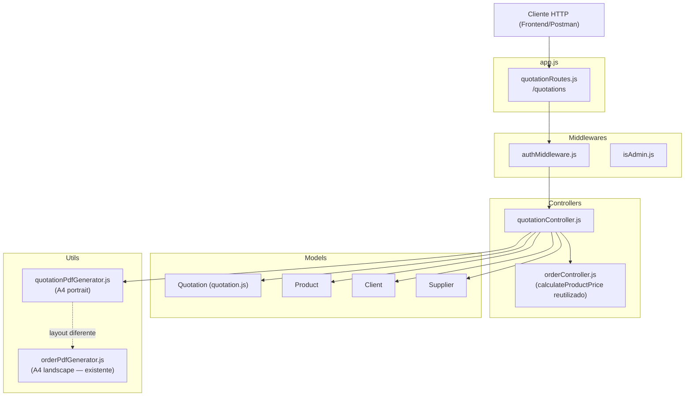
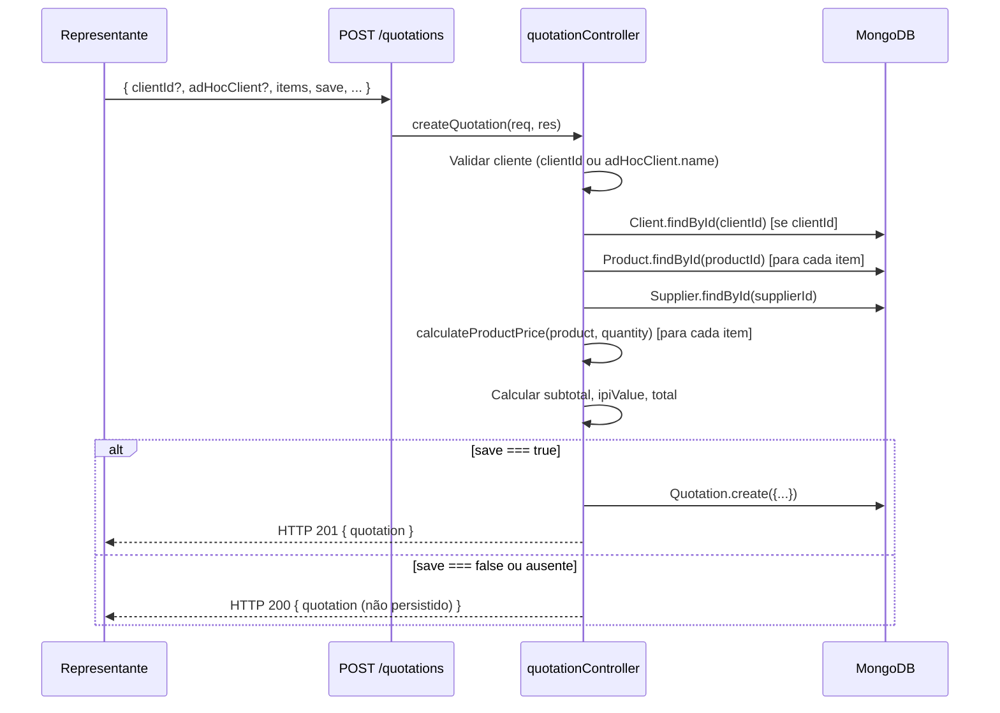
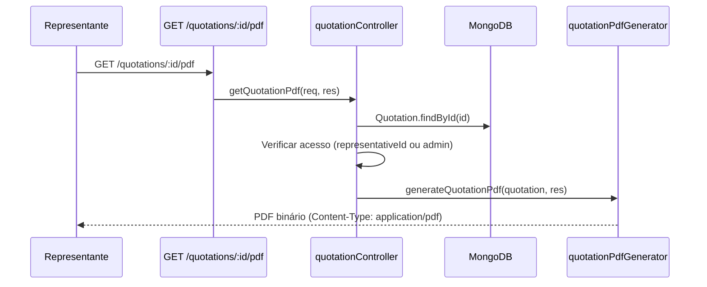

# Design Técnico — Orçamentos (Quotations)

## Visão Geral

A feature de orçamentos adiciona ao sistema a capacidade de gerar propostas comerciais para clientes cadastrados ou avulsos, sem incrementar o contador de pedidos do fornecedor e com persistência opcional. O resultado principal é um PDF A4 portrait com layout distinto do PDF de pedidos existente.

A implementação segue os padrões já estabelecidos no projeto: controllers Express, modelos Mongoose, rotas separadas por recurso e gerador de PDF com PDFKit. A lógica de cálculo de preço (`calculateProductPrice`) é reutilizada diretamente do `orderController.js`, evitando duplicação.

---

## Arquitetura

### Diagrama de Componentes



### Fluxo de Criação de Orçamento



### Fluxo de Geração de PDF



---

## Componentes e Interfaces

### 1. `src/models/quotation.js`

Modelo Mongoose para persistência de orçamentos salvos.

**Interface do Schema:**

```javascript
{
  clientId: ObjectId | null,          // ref: 'Client' — opcional (clientes avulsos)
  supplierId: ObjectId,               // ref: 'Supplier' — obrigatório
  representativeId: ObjectId,         // ref: 'User' — obrigatório
  clientSnapshot: {                   // dados do cliente no momento da criação
    name: String,
    tradeName: String,
    cnpj: String,
    stateRegistration: String,
    address: String,
    city: String,
    state: String,
    district: String,
    zipCode: String,
    phone: String,
    email: String,
    paymentTerm: String,
    notes: String,
  },
  supplierSnapshot: {                 // dados do fornecedor no momento da criação
    name: String,
    tradeName: String,
    cnpj: String,
    ipi: Number,
    logoUrl: String,
    city: String,
  },
  items: [{                           // itens do orçamento
    productId: ObjectId,              // ref: 'Product'
    productSnapshot: {
      supplierCode: String,
      clientCode: String,
      name: String,
      description: String,
      productType: String,
      material: String,
      saleMode: String,
      calculationMode: String,
      unitLabel: String,
      technicalData: Object,
      commercialData: Object,
      selectedExtras: Array,
    },
    quantity: Number,
    unitPrice: Number,
    subtotal: Number,
  }],
  subtotal: Number,                   // soma dos subtotais dos itens
  ipiValue: Number,                   // subtotal * (ipi / 100)
  total: Number,                      // subtotal + ipiValue
  attn: String,                       // "Aos cuidados de" — opcional
  observations: String,               // texto de condições comerciais (editável)
  sellerName: String,                 // nome do representante para assinatura
  deliveryDate: Date,                 // prazo de entrega
  paymentTerm: String,                // condição de pagamento
  status: String,                     // enum: ['active', 'cancelled']
}
```

**Diferenças em relação ao modelo `Order`:**
- Sem campo `orderNumber` (não incrementa contador do fornecedor)
- `clientId` é opcional (suporta clientes avulsos)
- Campos adicionais: `attn`, `observations`
- `supplierSnapshot` inclui `city` (necessário para o cabeçalho do PDF)
- Sem campos de pedido: `customerPurchaseOrder`, `sentToSupplier`, `sentToSupplierAt`, `sentToSupplierBy`, `notes`

---

### 2. `src/controllers/quotationController.js`

**Funções exportadas:**

| Função | Descrição |
|---|---|
| `createQuotation(req, res)` | Cria ou calcula orçamento conforme flag `save` |
| `getQuotations(req, res)` | Listagem paginada com filtros |
| `getQuotationById(req, res)` | Busca orçamento por ID com controle de acesso |
| `getQuotationPdf(req, res)` | Gera PDF de orçamento salvo |
| `generateQuotationPdf(req, res)` | Gera PDF direto sem salvar |
| `getClientProductsForQuotation(req, res)` | Lista produtos ativos de um cliente |

**`createQuotation` — lógica principal:**

```
1. Validar cliente:
   - Se clientId fornecido → buscar Client no banco → montar clientSnapshot
   - Se adHocClient.name fornecido → usar adHocClient como clientSnapshot
   - Caso contrário → HTTP 400 "Nome do cliente é obrigatório"

2. Validar items (não vazio)

3. Para cada item:
   - Buscar Product no banco
   - Verificar que todos os produtos são do mesmo supplierId
   - Chamar calculateProductPrice(product, quantity) [importado de orderController]
   - Montar productSnapshot

4. Buscar Supplier (para ipi e snapshot)
   - NÃO incrementar currentOrderNumber

5. Calcular totais:
   - subtotal = sum(item.subtotal)
   - ipiValue = subtotal * (ipi / 100)
   - total = subtotal + ipiValue

6. Se save === true:
   - Quotation.create({...}) → HTTP 201
   Senão:
   - Retornar objeto calculado → HTTP 200
```

**`getClientProductsForQuotation` — lógica:**

```
1. Extrair clientId e supplierId (opcional) de req.query
2. Verificar que Client existe
3. Montar filtro: { clientId, active: true, ...(supplierId && { supplierId }) }
4. Retornar produtos com campos selecionados
```

---

### 3. `src/utils/quotationPdfGenerator.js`

Gerador de PDF A4 portrait (595 x 842 pt) usando PDFKit. Reutiliza as funções utilitárias `resolveLogoPath`, `formatCurrency`, `sanitize` e `formatDateFile` do `orderPdfGenerator.js` (extraídas ou duplicadas).

**Layout do documento (A4 portrait — 595 x 842 pt, margens 40pt):**

```
┌─────────────────────────────────────────────────────┐  y=802
│  [LOGO ou Nome Fornecedor]    [Cidade, DD de Mês AAAA] │  y=780
├─────────────────────────────────────────────────────┤  y=760
│  ORÇAMENTO                                           │  y=745
├─────────────────────────────────────────────────────┤  y=730
│  Para: NOME DA EMPRESA CLIENTE (negrito)             │  y=715
│  A/C: [contato] (se attn preenchido)                 │  y=700
│  Segue abaixo nossa proposta...                      │  y=685
├─────────────────────────────────────────────────────┤  y=665
│  QTDE │ UN │ ITEM │ MILHEIRO │ TOT S/IPI │ IPI │ TOTAL │  y=650
├─────────────────────────────────────────────────────┤
│  [linhas de itens]                                   │
├─────────────────────────────────────────────────────┤
│                    Subtotal s/ IPI:  R$ xxx,xx       │
│                    Total IPI (x%):   R$ xxx,xx       │
│                    TOTAL GERAL:      R$ xxx,xx       │
├─────────────────────────────────────────────────────┤
│  Observações:                                        │
│  [texto de condições comerciais]                     │
├─────────────────────────────────────────────────────┤
│  No aguardo de um retorno positivo...                │
│                                                      │
│  [Nome do Representante]                             │
└─────────────────────────────────────────────────────┘
```

**Colunas da tabela de itens (largura útil ≈ 515pt):**

| Coluna | Largura | Conteúdo |
|---|---|---|
| QTDE | 45pt | `item.quantity` formatado |
| UN | 40pt | `productSnapshot.unitLabel` ou `saleMode` |
| ITEM | 185pt | `productSnapshot.description` ou `name` |
| MILHEIRO | 65pt | `formatCurrency(item.unitPrice)` |
| TOTAL S/IPI | 65pt | `formatCurrency(item.subtotal)` |
| VALOR IPI | 55pt | `formatCurrency(itemIpi)` |
| TOTAL | 60pt | `formatCurrency(itemTotal)` |

**Texto padrão de observações (quando não personalizado):**

```
Pagamento: [paymentTerm]
ICMS incluso no preço.
PIS/COFINS incluso no preço.
Prazo de entrega: [deliveryDate formatada]
Frete: CIF
Validade da proposta: 5 dias úteis.
```

**Nome do arquivo:** `ORCAMENTO-{NOME_CLIENTE_SANITIZADO}-{DD-MM-AAAA}.pdf`

---

### 4. `src/routes/quotationRoutes.js`

```javascript
// Rotas de orçamentos
POST   /quotations              → createQuotation       [authMiddleware]
POST   /quotations/pdf          → generateQuotationPdf  [authMiddleware]
GET    /quotations              → getQuotations         [authMiddleware]
GET    /quotations/client-products → getClientProductsForQuotation [authMiddleware]
GET    /quotations/:id          → getQuotationById      [authMiddleware]
GET    /quotations/:id/pdf      → getQuotationPdf       [authMiddleware]
```

> **Nota de ordenação de rotas:** A rota `/quotations/client-products` deve ser registrada **antes** de `/quotations/:id` para evitar que o Express interprete `client-products` como um parâmetro `:id`.

---

### 5. Atualização de `app.js`

Adicionar o registro da nova rota após as rotas existentes:

```javascript
const quotationRoutes = require('./src/routes/quotationRoutes');
// ...
app.use('/quotations', quotationRoutes);
```

---

## Modelos de Dados

### Schema Mongoose — `Quotation`

```javascript
// src/models/quotation.js

const quotationItemSchema = new mongoose.Schema({
  productId: {
    type: mongoose.Schema.Types.ObjectId,
    ref: 'Product',
    required: true,
  },
  productSnapshot: {
    supplierCode: String,
    clientCode: String,
    name: String,
    description: String,
    productType: String,
    material: String,
    saleMode: String,
    calculationMode: String,
    unitLabel: String,
    technicalData: Object,
    commercialData: Object,
    selectedExtras: Array,
  },
  quantity: { type: Number, required: true, min: 0 },
  unitPrice: { type: Number, required: true, min: 0 },
  subtotal: { type: Number, required: true, min: 0 },
}, { _id: false });

const quotationSchema = new mongoose.Schema({
  clientId: {
    type: mongoose.Schema.Types.ObjectId,
    ref: 'Client',
    default: null,           // opcional — null para clientes avulsos
  },
  supplierId: {
    type: mongoose.Schema.Types.ObjectId,
    ref: 'Supplier',
    required: true,
  },
  representativeId: {
    type: mongoose.Schema.Types.ObjectId,
    ref: 'User',
    required: true,
  },
  clientSnapshot: {
    name: { type: String, required: true },
    tradeName: String,
    cnpj: String,
    stateRegistration: String,
    address: String,
    city: String,
    state: String,
    district: String,
    zipCode: String,
    phone: String,
    email: String,
    paymentTerm: String,
    notes: String,
  },
  supplierSnapshot: {
    name: String,
    tradeName: String,
    cnpj: String,
    ipi: Number,
    logoUrl: String,
    city: String,
  },
  items: { type: [quotationItemSchema], required: true, default: [] },
  subtotal: { type: Number, required: true, default: 0 },
  ipiValue: { type: Number, required: true, default: 0 },
  total: { type: Number, required: true, default: 0 },
  attn: { type: String, trim: true },
  observations: { type: String, trim: true },
  sellerName: { type: String, trim: true, default: 'Valquiria Silvestre' },
  deliveryDate: { type: Date },
  paymentTerm: { type: String, trim: true },
  status: { type: String, enum: ['active', 'cancelled'], default: 'active' },
}, { timestamps: true });
```

### Índices

```javascript
quotationSchema.index({ representativeId: 1, createdAt: -1 });
quotationSchema.index({ supplierId: 1, createdAt: -1 });
```

### Payload de Entrada — `POST /quotations`

```json
{
  "clientId": "ObjectId | null",
  "adHocClient": {
    "name": "string (obrigatório se clientId ausente)",
    "tradeName": "string?",
    "cnpj": "string?",
    "stateRegistration": "string?",
    "address": "string?",
    "city": "string?",
    "state": "string?",
    "district": "string?",
    "zipCode": "string?",
    "phone": "string?",
    "email": "string?",
    "paymentTerm": "string?",
    "notes": "string?"
  },
  "items": [
    {
      "productId": "ObjectId",
      "quantity": "number"
    }
  ],
  "save": "boolean (default: false)",
  "attn": "string?",
  "observations": "string?",
  "sellerName": "string?",
  "deliveryDate": "date?",
  "paymentTerm": "string?"
}
```

### Payload de Resposta — `GET /quotations`

```json
{
  "page": 1,
  "limit": 10,
  "total": 42,
  "totalPages": 5,
  "quotations": [ /* array de Quotation */ ]
}
```

---

## Propriedades de Corretude

*Uma propriedade é uma característica ou comportamento que deve ser verdadeiro em todas as execuções válidas de um sistema — essencialmente, uma declaração formal sobre o que o sistema deve fazer. Propriedades servem como ponte entre especificações legíveis por humanos e garantias de corretude verificáveis por máquina.*

### Property 1: Invariante de cálculo — subtotal é soma dos itens

*Para qualquer* lista de itens com subtotais individuais, o campo `subtotal` do orçamento deve ser exatamente igual à soma dos `subtotal` de todos os itens.

**Validates: Requirements 3.1**

---

### Property 2: Invariante de cálculo — ipiValue e total

*Para qualquer* orçamento com subtotal `S` e IPI do fornecedor `p`, deve valer que `ipiValue = S * (p / 100)` e `total = S + ipiValue`. Quando o fornecedor não possui IPI configurado (`ipi = 0`), `ipiValue` deve ser `0` e `total` deve ser igual a `subtotal`.

**Validates: Requirements 3.2, 3.3, 3.4**

---

### Property 3: Snapshot do cliente é imutável após criação

*Para qualquer* orçamento salvo com `save: true`, os dados do `clientSnapshot` devem ser idênticos aos dados do cliente (cadastrado ou avulso) no momento da criação, e não devem ser alterados por modificações posteriores no cadastro do cliente.

**Validates: Requirements 1.1, 1.2**

---

### Property 4: Snapshot do produto é fiel ao produto original

*Para qualquer* produto cadastrado no banco, o `productSnapshot` registrado no item do orçamento deve conter os mesmos valores dos campos `supplierCode`, `clientCode`, `name`, `description`, `saleMode`, `calculationMode`, `unitLabel`, `technicalData` e `commercialData` do produto no momento da criação do orçamento.

**Validates: Requirements 2.3**

---

### Property 5: Cálculo de preço é consistente com calculateProductPrice

*Para qualquer* produto com modo de cálculo válido e qualquer quantidade positiva, o `unitPrice` e o `subtotal` calculados pelo `quotationController` devem ser idênticos ao resultado de `calculateProductPrice(product, quantity)` do `orderController`.

**Validates: Requirements 2.6**

---

### Property 6: currentOrderNumber do fornecedor nunca é incrementado

*Para qualquer* orçamento criado (com `save: true` ou `save: false`), o campo `currentOrderNumber` do fornecedor associado deve permanecer inalterado antes e depois da operação.

**Validates: Requirements 4.3**

---

### Property 7: representativeId é sempre o usuário autenticado

*Para qualquer* orçamento salvo com `save: true`, o campo `representativeId` do documento persistido deve ser igual ao `id` do usuário autenticado que realizou a requisição.

**Validates: Requirements 4.4**

---

### Property 8: Isolamento de acesso por representante

*Para qualquer* par de representantes distintos A e B, o representante A nunca deve conseguir acessar via `GET /quotations/:id` um orçamento cujo `representativeId` seja B (deve receber HTTP 403).

**Validates: Requirements 8.2**

---

### Property 9: Listagem filtra por representante autenticado

*Para qualquer* representante autenticado com perfil `representante`, todos os orçamentos retornados por `GET /quotations` devem ter `representativeId` igual ao ID do usuário autenticado — nenhum orçamento de outro representante deve aparecer na listagem.

**Validates: Requirements 7.2**

---

### Property 10: Filtro de produtos por cliente e fornecedor

*Para qualquer* combinação de `clientId` e `supplierId` válidos, todos os produtos retornados por `GET /quotations/client-products` devem ter `active: true`, `clientId` igual ao informado e, quando `supplierId` for fornecido, `supplierId` igual ao informado.

**Validates: Requirements 6.1, 6.2**

---

## Tratamento de Erros

| Situação | HTTP | Mensagem |
|---|---|---|
| `clientId` não encontrado | 404 | `"Cliente não encontrado"` |
| `clientId` ausente e `adHocClient.name` ausente/vazio | 400 | `"Nome do cliente é obrigatório"` |
| `items` vazio ou ausente | 400 | `"Itens são obrigatórios"` |
| `productId` não encontrado | 404 | `"Produto não encontrado"` |
| Produtos de fornecedores diferentes | 400 | `"Todos os produtos devem ser do mesmo fornecedor"` |
| Produto sem preço válido | 400 | mensagem descritiva do `calculateProductPrice` |
| Orçamento não encontrado (por ID) | 404 | `"Orçamento não encontrado"` |
| Acesso a orçamento de outro representante | 403 | `"Acesso negado"` |
| Token JWT ausente ou inválido | 401 | (gerenciado pelo `authMiddleware`) |
| Erro interno inesperado | 500 | `"Erro ao criar orçamento"` / `"Erro ao buscar orçamentos"` / etc. |

**Estratégia de tratamento:**
- Erros de validação de negócio são capturados com `try/catch` e retornam respostas HTTP específicas, seguindo o padrão do `orderController.js`.
- Erros de cálculo lançados por `calculateProductPrice` são capturados e retornados como HTTP 400 com a mensagem original do erro.
- Erros inesperados retornam HTTP 500 sem vazar detalhes internos (apenas em `NODE_ENV=development`).

---

## Estratégia de Testes

### Abordagem Dual

A cobertura de testes combina testes unitários/de exemplo com testes baseados em propriedades (PBT), seguindo o padrão já estabelecido no projeto com Jest.

**Biblioteca de PBT:** [`fast-check`](https://github.com/dubzzz/fast-check) — biblioteca madura para JavaScript/Node.js, compatível com Jest, sem dependências externas pesadas.

```bash
npm install --save-dev fast-check
```

### Testes Unitários (`tests/controllers/quotationController.test.js`)

Cobrem comportamentos específicos e casos de borda:

- Criação com `clientId` válido → snapshot correto
- Criação com `adHocClient` → snapshot correto
- Criação sem cliente → HTTP 400
- `clientId` inexistente → HTTP 404
- `items` vazio → HTTP 400
- `productId` inexistente → HTTP 404
- Produtos de fornecedores diferentes → HTTP 400
- `save: true` → persiste no banco, retorna HTTP 201
- `save: false` → não persiste, retorna HTTP 200
- `currentOrderNumber` não é incrementado
- Acesso a orçamento de outro representante → HTTP 403
- Admin acessa qualquer orçamento → HTTP 200

### Testes de Propriedade (`tests/controllers/quotationController.property.test.js`)

Cada propriedade do design é implementada como um único teste PBT com mínimo de 100 iterações:

```javascript
// Exemplo de estrutura
const fc = require('fast-check');

// Feature: quotations, Property 1: subtotal é soma dos itens
test('subtotal é sempre a soma dos subtotais dos itens', () => {
  fc.assert(
    fc.property(
      fc.array(fc.record({ subtotal: fc.float({ min: 0, max: 10000 }) }), { minLength: 1 }),
      (items) => {
        const expectedSubtotal = items.reduce((acc, i) => acc + i.subtotal, 0);
        // ... verificar que o controller produz o mesmo resultado
      }
    ),
    { numRuns: 100 }
  );
});
```

**Tag de referência para cada teste PBT:**
```
// Feature: quotations, Property N: <texto da propriedade>
```

### Testes de Integração (`tests/integration/quotations.test.js`)

Cobrem o fluxo completo com banco em memória (mongodb-memory-server):

- `POST /quotations` com `save: true` → documento no banco
- `POST /quotations` com `save: false` → sem documento no banco
- `POST /quotations/pdf` → retorna PDF válido (Content-Type: application/pdf)
- `GET /quotations` → paginação e filtros
- `GET /quotations/:id` → controle de acesso
- `GET /quotations/:id/pdf` → retorna PDF válido
- `GET /quotations/client-products` → filtragem correta

### Testes de Utilitário (`tests/utils/quotationPdfGenerator.test.js`)

- PDF gerado tem dimensões A4 portrait (595 x 842 pt)
- Nome do arquivo segue o padrão `ORCAMENTO-{CLIENTE}-{DATA}.pdf`
- Texto do cliente aparece no PDF (via `pdf-parse`)
- Totais aparecem no PDF
- Texto de encerramento fixo aparece no PDF
- Logo é exibida quando `logoUrl` é válido; nome textual quando inválido

### Configuração PBT

```javascript
// jest.config.js — sem alterações necessárias
// fast-check integra nativamente com Jest

// Cada teste de propriedade usa:
fc.assert(fc.property(...), { numRuns: 100 })
```
